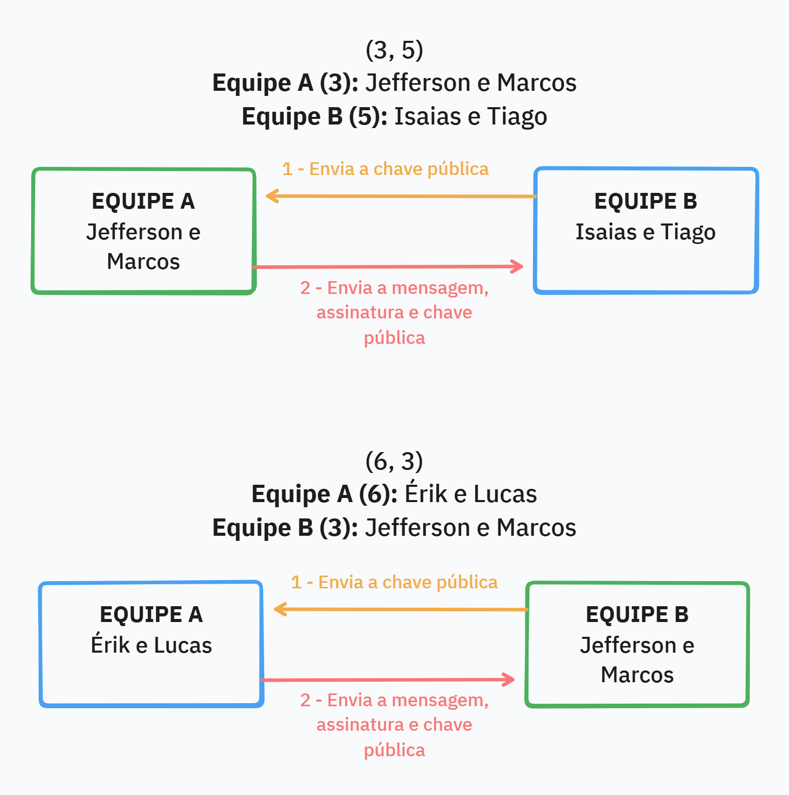

# Criptografia e Assinatura Digital

**Alunos:**\
José Jefferson Dantas Araújo\
Marcos Paulo Santos Lira

## Esquema mostrando o que será enviado



## Organização dos arquivos

```
📂codigo/
├─ 📄acoes.py        --> Funções principais onde interagem com os arquivos e printam mensagens no terminal
├─ 📄criptografia.py --> Simplificação das funções de criptografia
├─ 📄exemplo.py      --> Exemplo de uso das funções, para testá-las sem ler/escrever arquivos
├─ 📄main.py         --> Interface de linha de comando para executar as funções
└─ 📄utils.py        --> Funções utilitárias que simplificam a leitura/escrita de arquivos e prints no terminal

📂erik_lucas/                  --> Arquivos referentes a comunicação com a equipe Érik e Lucas
├─ 📄assinatura_verificada.txt --> Resultado da verificação da assinatura
├─ 📄assinatura.bin            --> Assinatura que recebemos
├─ 📄chave_privada_b.pem       --> Nossa chave privada
├─ 📄chave_publica_a.pem       --> Chave pública deles
├─ 📄chave_publica_b.pem       --> Nossa chave pública
├─ 📄mensagem_cripto.txt       --> Mensagem que recebemos criptografada
└─ 📄mensagem_recebida.txt     --> Mensagem depois de descriptografar

📂isaias_tiago/          --> Arquivos referentes a comunicação com a equipe Isaias e Tiago
├─ 📄assinatura.bin      --> Assinatura que enviamos
├─ 📄chave_privada_a.pem --> Nossa chave privada
├─ 📄chave_publica_a.pem --> Nossa chave pública
├─ 📄chave_publica_b.pem --> Chave pública deles
├─ 📄mensagem_cripto.txt --> Nossa mensagem depois que criptografamos
└─ 📄mensagem.txt        --> Nossa mensagem
```

## Passo a passo do processo de criptografia e assinatura digital

### Jefferson e Marcos --> Isaias e Tiago

1. A equipe B _(Isaias e Tiago)_ gerou um par de chaves pública e privada usando o algoritmo RSA.
2. Eles enviaram a chave pública para nós _(Jefferson e Marcos)_.
3. Nós armazenamos a chave pública deles no arquivo [`isaias_tiago/chave_publica_b.pem`](isaias_tiago/chave_publica_b.pem).
4. Nós geramos um par de chaves pública e privada (RSA com 512 bits) para nós mesmos e salvamos a chave privada no arquivo [`isaias_tiago/chave_privada_a.pem`](isaias_tiago/chave_privada_a.pem) e a chave pública no arquivo [`isaias_tiago/chave_publica_a.pem`](isaias_tiago/chave_publica_a.pem), no formato PKCS#1 e PEM, usando a função `gerar_chaves_e_guardar()` do arquivo [`codigo/acoes.py`](codigo/acoes.py).
5. Criamos e criptografamos a mensagem usando RSA com a chave pública deles, usando a função `criptografar()` do arquivo [`codigo/acoes.py`](codigo/acoes.py).
6. Salvamos a mensagem criptografada no arquivo [`isaias_tiago/mensagem_cripto.txt`](isaias_tiago/mensagem_cripto.txt) no formato Base64.
7. Também salvamos a mensagem original no arquivo [`isaias_tiago/mensagem.txt`](isaias_tiago/mensagem.txt).
8. Geramos a assinatura digital da mensagem usando a nossa chave privada e salvamos no arquivo [`isaias_tiago/assinatura.bin`](isaias_tiago/assinatura.bin) no formato Base64, ainda na mesma função.
9. Enviamos a mensagem criptografada, a assinatura digital, e a nossa chave pública (para verificar assinatura) para a equipe B.

### Érik e Lucas --> Jefferson e Marcos

1. Nós _(Jefferson e Marcos)_ geramos um par de chaves pública e privada (RSA 512 bits) e salvamos a chave privada no arquivo [`erik_lucas/chave_privada_b.pem`](erik_lucas/chave_privada_b.pem) e a chave pública no arquivo [`erik_lucas/chave_publica_b.pem`](erik_lucas/chave_publica_b.pem), usando a função `gerar_chaves_e_guardar()` do arquivo [`codigo/acoes.py`](codigo/acoes.py).
2. Enviamos a chave pública para a equipe A _(Érik e Lucas)_.
3. Eles criaram a mensagem, assinaram e enviaram a mensagem criptografada, a assinatura digital, e a chave pública deles para nós.
4. Nós salvamos:

- A mensagem deles no arquivo [`erik_lucas/mensagem_cripto.txt`](erik_lucas/mensagem_cripto.txt).
- A assinatura digital no arquivo [`erik_lucas/assinatura.bin`](erik_lucas/assinatura.bin).
- A chave pública deles no arquivo [`erik_lucas/chave_publica_a.pem`](erik_lucas/chave_publica_a.pem).

5. Descriptografamos a mensagem usando a nossa chave privada e armazenamos a mensagem original no arquivo [`erik_lucas/mensagem_recebida.txt`](erik_lucas/mensagem_recebida.txt), usando a função `descriptografar()` do arquivo [`codigo/acoes.py`](codigo/acoes.py).
6. Verificamos a assinatura digital usando a chave pública deles e confirmamos que a mensagem é autêntica, usando a função `verif_assinatura()` do arquivo [`codigo/acoes.py`](codigo/acoes.py). Armazenamos o resultado da verificação no arquivo [`erik_lucas/assinatura_verificada.txt`](erik_lucas/assinatura_verificada.txt).

## Dificuldades encontradas

A organização dos arquivos e a nomenclatura foram um pouco confusas, então decidimos colocar os arquivos referentes a cada equipe em pastas separadas.
